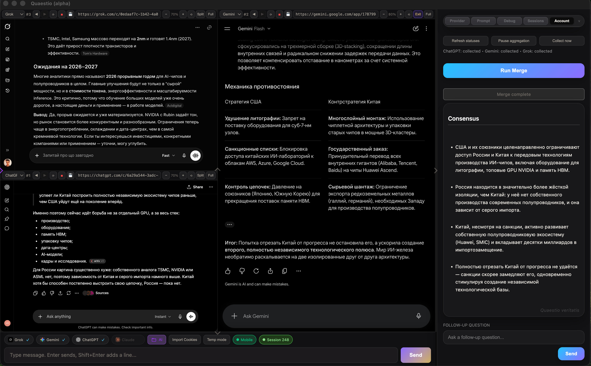
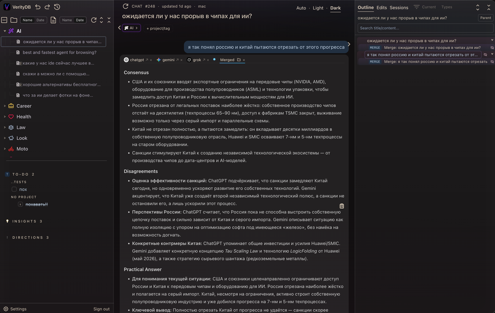
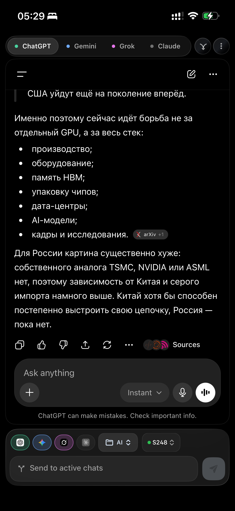
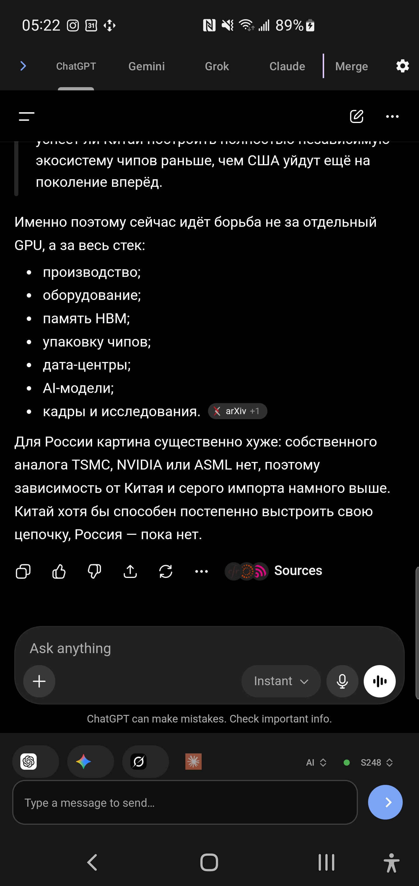

<sub>Q U A E S T I O&nbsp;&nbsp;|&nbsp;&nbsp;V E R I T Y _ D B</sub>

# Quaestio + VerityDB

**🕸️ Your AI work, finally STRUCTURED: a knowledge GRAPH you OWN, not another multi-LLM aggregator.**

Broadcasting one prompt to ChatGPT, Claude, Gemini and Grok at once is just the CAPTURE step. The real PRODUCT is what you KEEP:

- 🌳 **A multibranching tree, not folders.** The SAME note lives in MANY trees at once; a subproject belongs to several projects.
- ⚡ **Resume anything, instantly.** Grab any thread, across every model, a month later, and pick it right back up.
- ✨ **Prune to the GOLD.** Branch a project, fork a note, throw out the noise, keep only what matters.
- 🔍 **Never lose a chat.** Full text search across everything you ever captured.
- 📱 **Yours everywhere.** Desktop, iOS, Android and web, always in sync.

I use these models every day, and not one of them lets you STRUCTURE the work like this. So I built it myself. 🛠️

<sub>💡 Aggregation is only the METHOD, not the point. Firing one prompt at every model is just how the tree fills up: each prompt runs against your own signed in model accounts, so you keep your real history, memory and subscriptions (not a stripped down API), and every answer is merged into a structured note you can branch, link, prune and search. The GOAL is bigger than the broadcast: an owned, growing knowledge layer that outlives any single chat. The Merge step uses your own key: DeepSeek, OpenAI, Gemini, Claude, OpenRouter, or any OpenAI compatible endpoint.</sub>

🔗 **Waitlist / early access: [veritydb.vercel.app](https://veritydb.vercel.app)**





<p align="center">
  
  
</p>

<sub>VerityDB web also ships a light mode: [docs/screens/web-light.png](docs/screens/web-light.png)</sub>

## Clients in this repo

| Directory | Client | Stack |
| --- | --- | --- |
| [`desktop/`](desktop/) | Windows / macOS / Linux | Electron |
| [`mobile/`](mobile/) | iOS + Android | SwiftUI / Kotlin, shared JS provider core |

Both clients consume the same provider contracts (`mobile/shared/contracts/`) and injected DOM scripts (`mobile/shared/js/`), so "how to talk to each chat service" is defined once.

Quick start — desktop:

```bash
cd desktop && npm install && npm start
```

Mobile builds: see [`mobile/README.md`](mobile/README.md).

## How the knowledge layer works *(invite-only for now)*

The hero above is the *what*. Here is the *how*. Quaestio runs fully standalone and local; signed in, every aggregated Q&A flows into **VerityDB** ([veritydb.vercel.app](https://veritydb.vercel.app)) and becomes part of the graph you own. In practice that means:

- 📝 **Capture is automatic.** The question, each model's answer, and the merged synthesis land as one structured note. No copy paste.
- 🎯 **It extracts the signal, not just stores it.** Mark a line `[ ]` todo, `💡` insight, or `!` direction and Quaestio pulls those into structured takeaways you can act on. *(Coming: instruct the models to answer in that markup once, and every aggregated answer auto generates its own TODOs, insights and next steps.)*
- 🔍 **You cannot lose a chat.** Instant full text search across everything you ever captured.
- 📱 **Cross-device + Notion export.** Desktop, iOS, Android and web stay synced; push takeaways straight into Notion via server-side OAuth.
- 🔒 **Yours by default.** Until you request access (and by choice anytime after) the apps run fully local: everything stays on device, zero backend calls.

Accounts are invite only for now. Request access at [veritydb.vercel.app](https://veritydb.vercel.app).

## ⚠️ KNOWN ISSUES

**Google sign-in inside the chat slots is a pain.** Google actively blocks
sign-in from embedded WebViews ("This browser or app may not be secure"), so
logging into Gemini — and into ChatGPT/Grok via the "Continue with Google"
button — can take a few attempts. Workarounds, in order of reliability:

1. **Cookie import — the bulletproof option.** Sign in to the service in your
   normal browser, export the cookies, import them into the app (desktop:
   `Ctrl+I` / Import 🍪, see [desktop/docs/COOKIE_IMPORT.md](desktop/docs/COOKIE_IMPORT.md)).
   The slot picks up your real session instantly.
2. **User-agent switching (iOS).** The iPhone app can change the WebView
   user agent specifically so Google's WebView detection backs off — switch
   the UA, sign in, switch back if needed.
3. Sign in with the service's **native email/password** login instead of the
   "Continue with Google" button where possible — it usually passes.

## Privacy

- The apps ship **no LLM provider keys and no secrets**. Merge uses your own key, stored on-device.
- Chat slots authenticate through each service's own login inside the WebView; credentials never pass through any Quaestio/Verity server.
- No analytics, no telemetry, no chat content collection. In local mode the apps make zero backend calls (covered by tests on all platforms).

## License

Dual-licensed (see [NOTICE](NOTICE)): `AGPL-3.0-only OR LicenseRef-Commercial`

- **AGPL-3.0** ([LICENSE](LICENSE)) — use it for anything, commercial included.
  The condition is copyleft: if you distribute the app or let users interact
  with a modified version over a network, you must offer your complete
  modified source under AGPL-3.0, attribution retained.
- **Proprietary option** — a separate non-AGPL license (no copyleft
  conditions) is available from the owner: k.vitaliq@gmail.com.

Contributions are welcome under the inbound-license terms in
[CONTRIBUTING.md](CONTRIBUTING.md). Changelogs: [desktop](desktop/CHANGELOG.md) · [mobile](mobile/CHANGELOG.md).

---

*Keywords: multi-LLM client, AI chat aggregator, compare ChatGPT Claude Gemini Grok DeepSeek Perplexity side by side, one prompt to multiple AI models, merge AI answers, LLM answer synthesis, ensemble prompting, AI knowledge base, personal AI notes, Electron iOS Android.*
